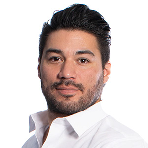

# Ability360

Not an FY25 funded partner of Valley of the Sun United Way.

## About

Ability360 is a Phoenix-based nonprofit and one of Arizona's largest Centers for Independent Living. The organization has served people with disabilities for more than 40 years and describes its work as helping people achieve or continue independent lifestyles within the community.

The organization began as the Arizona Congress for Action in the late 1970s, grew into a funded independent living center in 1981, and has since developed a broad portfolio of disability services. Those services include independent living skills instruction, information and referral, peer support, advocacy, home modification, ADA training and counseling, outreach to rehabilitation centers and early intervention for newly disabled individuals, reintegration to the community, employment services, social security work incentives consulting, youth transition support, home care services, socialization through recreation, and sports and fitness programming.

Ability360 emphasizes consumer choice, self-determination, and full integration into community life. Its model is built around people with disabilities directing their own lives and making informed decisions about the support they receive. The organization also highlights the fact that at least 51 percent of its staff and board members are people with disabilities, ensuring that lived experience helps guide its work.

With offices in Phoenix, Gilbert/Mesa, Glendale, Tucson, and other communities, Ability360 provides services across Maricopa, Pima, Pinal, and Gila counties. Its public materials position the organization as a practical, advocacy-oriented resource for people with disabilities, their families, employers, and community partners.

## Mission & Vision

Ability360's mission is to offer and promote programs designed to empower people with disabilities to take personal responsibility so that they may achieve or continue independent lifestyles within the community.

The organization's broader vision is reflected in its principles and service model: maximize independence, encourage self-sufficiency, increase consumer control, remove barriers, and support full integration and equal opportunity in community life. Ability360 frames independent living as the freedom to direct one's own life with the support needed to participate fully in home, work, and community settings.

The organization also promotes peer leadership and self-advocacy, reinforcing the belief that people with disabilities should be in charge of their own lives and involved in decisions affecting programs and services. Its mission is therefore not just about direct services but about empowerment, rights, and community inclusion.

## Executive Leadership

| Name | Designation | Photo |
| --- | --- | --- |
| Christopher Rodriguez | President and CEO |  |

