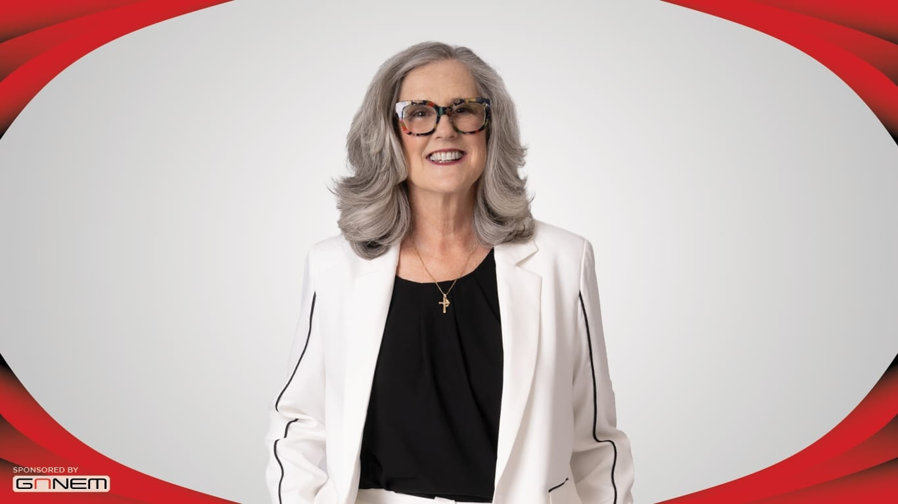

# AllThrive 365

Not an FY25 funded partner of Valley of the Sun United Way.

## About

AllThrive 365 is an Arizona nonprofit formerly known as Foundation for Senior Living. Founded in 1974, the organization helps Arizonans age safely, independently, and with peace of mind by combining health, housing, caregiving, nutrition, behavioral health, transportation, and community support services.

The organization publicly rebranded from Foundation for Senior Living to AllThrive 365 in 2025 after more than 50 years of service. The new identity reflects its broader goal of helping people thrive every day of the year while continuing the trusted work built under the FSL name.

AllThrive 365 uses a holistic approach to aging and community care. Its work includes affordable housing, adult day health services, home care, home health, home improvements, weatherization, caregiver training, community resource centers, behavioral health support, transitional care, transportation, emergency assistance, and nutrition services.

The organization focuses especially on under-resourced individuals, older adults, families, caregivers, veterans, people with disabilities, low-income residents, and people who need practical help remaining safe and stable at home. Its services are designed to address the whole person rather than a single need, recognizing that health, housing, food access, social connection, caregiving, and independence are deeply connected.

AllThrive 365's work is also shaped by Arizona's rapidly growing older adult population. As more residents age, the organization is positioning itself to meet rising demand for aging services, housing stability, transportation, home safety, caregiver support, and preventive care. It describes its work as helping people not merely get by, but thrive with dignity and confidence.

## Mission & Vision

AllThrive 365's mission is to redefine what it means to age so that, in times of preparation and crisis, all in the community can age independently and with peace of mind.

The organization's vision is reflected in its belief that everyone deserves the right to age with confidence. It works toward an Arizona where people can live safely, remain connected, access needed care and resources, and experience dignity throughout the aging journey.

AllThrive 365 emphasizes whole-person support. Its approach brings together physical and mental wellbeing, affordable and safe housing, social connection, caregiver support, transportation, nutrition, and community-based services so that individuals and families have practical pathways to stability and independence.

## Executive Leadership

| Name | Designation | Photo |
| --- | --- | --- |
| Tamara Bohannon | President and Chief Executive Officer |  |
