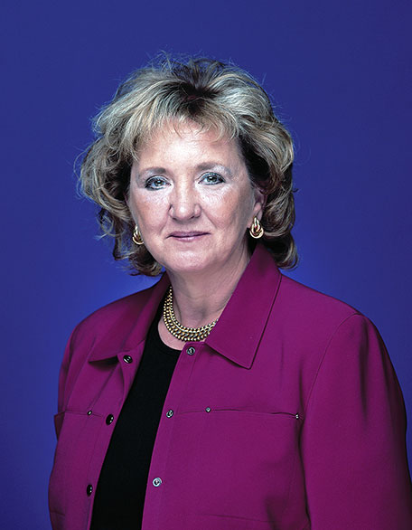

# Area Agency on Aging, Region One

Not an FY25 funded partner of Valley of the Sun United Way.

## About

Area Agency on Aging, Region One is a private nonprofit organization serving Maricopa County. The agency plans, develops, funds, administers, and coordinates programs and services for older adults, caregivers, adults with disabilities and long-term care needs, people living with HIV, and other underserved populations.

The organization serves adults age 60 and older, family caregivers of older adults, adults ages 18 to 59 with physical disabilities and long-term care needs, and adults age 18 and older with HIV. It also supports special populations including elder refugees, people with behavioral health conditions, and victims of late-life domestic violence, elder abuse, and sexual assault.

Area Agency on Aging, Region One operates the 24-hour Senior HELP LINE, which provides information, referral, and assistance for older adults, caregivers, and community members seeking support. The HELP LINE connects people to services such as transportation, housing, long-term care, home-delivered meals, home care, caregiver support, behavioral health resources, and other community assistance.

The agency is a licensed behavioral health provider through the Arizona Department of Health Services and is certified to bill Medicare and AHCCCS for mental health services. Its Information and Referral Specialists are certified by Inform USA, and the agency has been accredited by the Council on Accreditation since 2006.

Through its programs, funding partnerships, planning work, and community coordination, Area Agency on Aging, Region One helps older adults and vulnerable adults remain connected, supported, safer, and more independent. Its work includes direct services, contracted programs, advocacy, community planning, and support systems that respond to changing needs across Maricopa County.

## Mission & Vision

Area Agency on Aging, Region One's mission is to partner with the community to foster innovative programs and services that enrich the quality of life for older adults, caregivers, and underserved populations.

Its vision is a community where adults thrive along life's journey.

The organization works toward that mission by coordinating services, building partnerships, promoting public awareness, supporting caregiver and aging services, responding to elder abuse and domestic violence, and helping people navigate complex health, housing, behavioral health, and long-term care systems.

## Executive Leadership

| Name | Designation | Photo |
| --- | --- | --- |
| Mary Lynn Kasunic | President and Chief Executive Officer |  |
