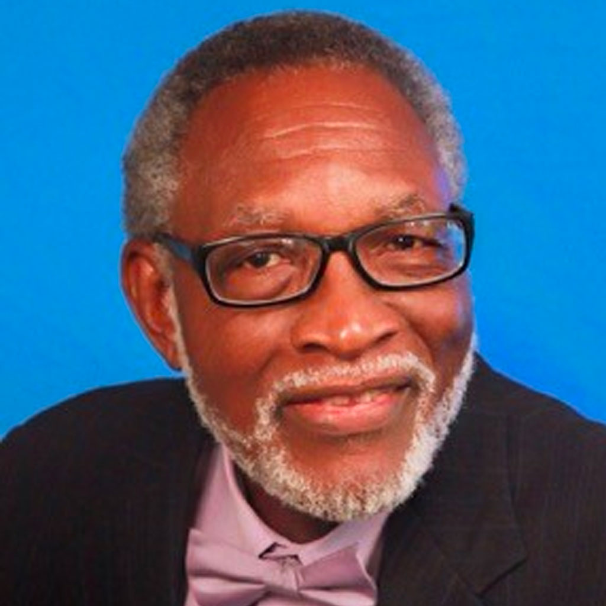

# Arizona Center for African American Resources

Not an FY25 funded partner of Valley of the Sun United Way.

## About

Arizona Center for African American Resources, commonly known as AZCAAR, is an Arizona nonprofit founded in 2007 to improve the life challenges facing African Americans in Arizona. The organization serves as a resource for people, organizations, and partners working with and for the African American community across the state.

AZCAAR focuses on giving voice and visibility to African Americans in Arizona by supporting work in civic engagement, communications, criminal justice, economics, education, health and well-being, leadership, and racial equity. Its role is to convene, collaborate, share resources, and support community conversations around issues that have socioeconomic and civic impact within the African American community.

The organization provides access to African American subject matter experts in areas such as community organization, child well-being, diversity issues, education, healthcare, juvenile justice, and leadership. AZCAAR also develops and shares resource materials, reports, presentations, and community information intended to help individuals, families, organizations, and institutions better understand and respond to the needs of African Americans in Arizona.

AZCAAR's community resource work includes an AZCAAR Resource Guide with links to organizations and supports aligned with its mission. It has also participated in collaborative research and reporting focused on funding equity, inclusion, education, mental and physical health, well-being, and the needs of African American families and children in Arizona.

Through its events, community efforts, collaborations, and partnerships, AZCAAR works to create space for discussion, problem-solving, and action around issues that affect African American communities. The organization invites community members and partners to support its work through participation, collaboration, and giving.

## Mission & Vision

AZCAAR's mission is to improve the quality of life of African Americans in Arizona.

Its vision is to convene and collaborate with Arizonans to discuss and resolve issues that have socioeconomic and civic impact within the African American community.

The organization frames its work around resource-sharing, community collaboration, civic impact, racial equity, education, health and well-being, leadership, and visibility for African Americans in Arizona.

## Executive Leadership

| Name | Designation | Photo |
| --- | --- | --- |
| Roy Thomas Dawson | Executive Director |  |
