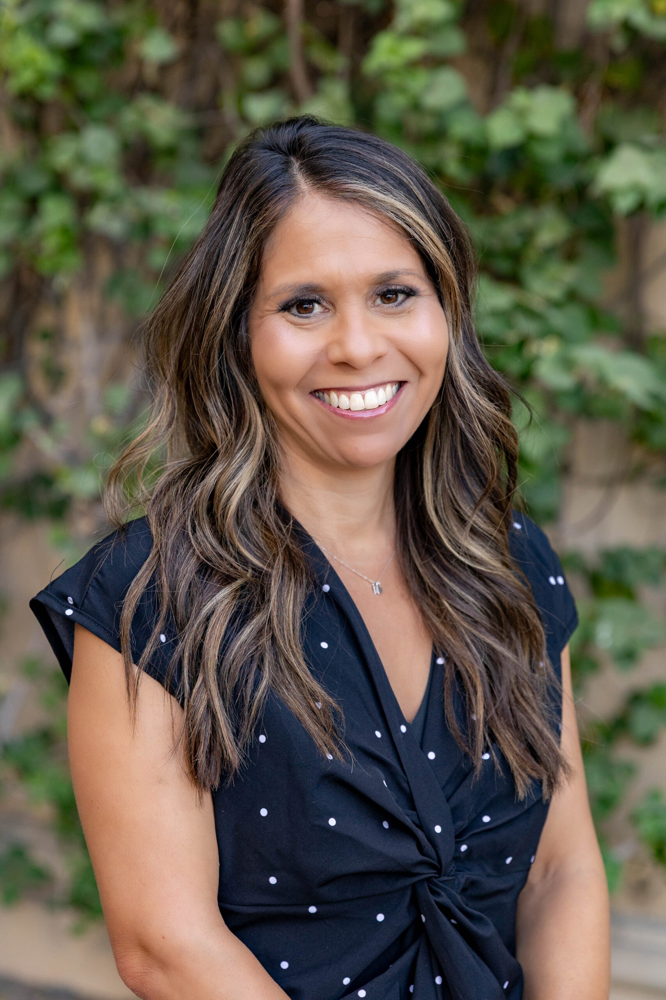

# Big Brothers Big Sisters of Central Arizona

Is an FY25 funded partner of Valley of the Sun United Way.

## About

Big Brothers Big Sisters of Central Arizona, commonly known as BBBSAZ, is a Phoenix-based youth mentoring nonprofit that helps children and teens realize their potential through meaningful, supported relationships. The organization serves young people in Central Arizona by matching them with adult mentors and peer mentors who provide consistent guidance, encouragement, friendship, and support.

BBBSAZ has served the community for 70 years. Its history includes the founding of Big Sisters of Arizona in 1955, Valley Big Brothers in 1966, the merger that formed Valley Big Brothers Big Sisters, and the later expansion into Big Brothers Big Sisters of Central Arizona to cover parts of Maricopa, Pinal, and Gila counties. The organization now serves more than 2,000 youth annually through mentoring, family resources, and community partnerships.

The organization's primary work is one-to-one mentoring. In community-based mentoring, adult volunteers are matched with children and teens for consistent outings and shared activities in the community. In site-based mentoring, mentors and youth meet at partner locations such as schools, youth centers, or after-school sites. These relationships are intentionally matched, monitored, and supported by professional staff so that youth, families, and volunteers have guidance throughout the match.

BBBSAZ also operates school-based peer mentoring and other youth-centered programs that help participants build confidence, strengthen relationships, develop social skills, pursue educational success, and explore future goals. Its mentoring model is designed to help young people overcome barriers, feel seen and supported, and develop the confidence and resilience needed to thrive.

The organization is supported by volunteers, donors, staff, families, schools, partner organizations, and community supporters. It also operates a donation center in partnership with Savers Thrift Stores, collecting gently used clothing and household items to generate unrestricted revenue for mentoring programs.

## Mission & Vision

BBBSAZ's mission is to create and support one-to-one mentoring relationships that ignite the power and promise of youth.

Its vision is that all youth achieve their full potential.

The organization values belonging, resilience, accountability, vision, and empathy. Across its work, BBBSAZ emphasizes acceptance, inclusion, transparency, careful stewardship, innovation, kindness, and the belief that strong mentoring relationships can help young people become confident leaders, changemakers, and contributors to a stronger community.

## Executive Leadership

| Name | Designation | Photo |
| --- | --- | --- |
| Debbie Castillo-Smith | President and Chief Executive Officer |  |
