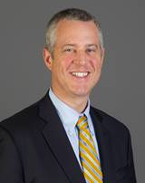

# Boy Scouts of America, Grand Canyon Chapter

Not an FY25 funded partner of Valley of the Sun United Way.

## About

The Grand Canyon Council, also known as Scouting Arizona, is the local Boy Scouts of America council serving most of central and northern Arizona, along with the greater Yuma area. It is a legally and financially independent nonprofit that delivers Scouting programs on the local level while remaining chartered by the national Boy Scouts of America organization.

The council's purpose is to deliver Scouting experiences that help young people build character, learn citizenship, and develop personal fitness. Its website describes the local council as a system of volunteer and professional Scouters working together to build strong units, empower leaders, and deliver camps and programs that enrich the local Scouting experience.

Grand Canyon Council positions itself as an organization that helps youth discover their path and grow into the best version of themselves. Its program model reflects the broader Scouting tradition of outdoor learning, peer leadership, service, and personal responsibility, while the council's local mission focuses on strengthening and expanding Scouting in Arizona.

## Mission & Vision

The mission of Grand Canyon Council is to strengthen and expand Scouting in Arizona by building strong units, empowering leaders, and delivering programs and camps that enrich the local Scouting experience.

Its vision is that together, volunteer and professional Scouters create an environment where every young person can discover their path, live the ideals of the Scout Oath, Law, and Motto, and grow into the best version of themselves.

The council's mission and vision are tied to the broader Boy Scouts of America purpose of helping youth develop ethical and moral decision-making, citizenship, and fitness. In practice, that means creating local Scouting opportunities that are organized, values-based, and supported by volunteers and staff across the council territory.

## Executive Leadership

| Name | Designation | Photo |
| --- | --- | --- |
| Andy Price | Scout Executive and Chief Executive Officer | |

