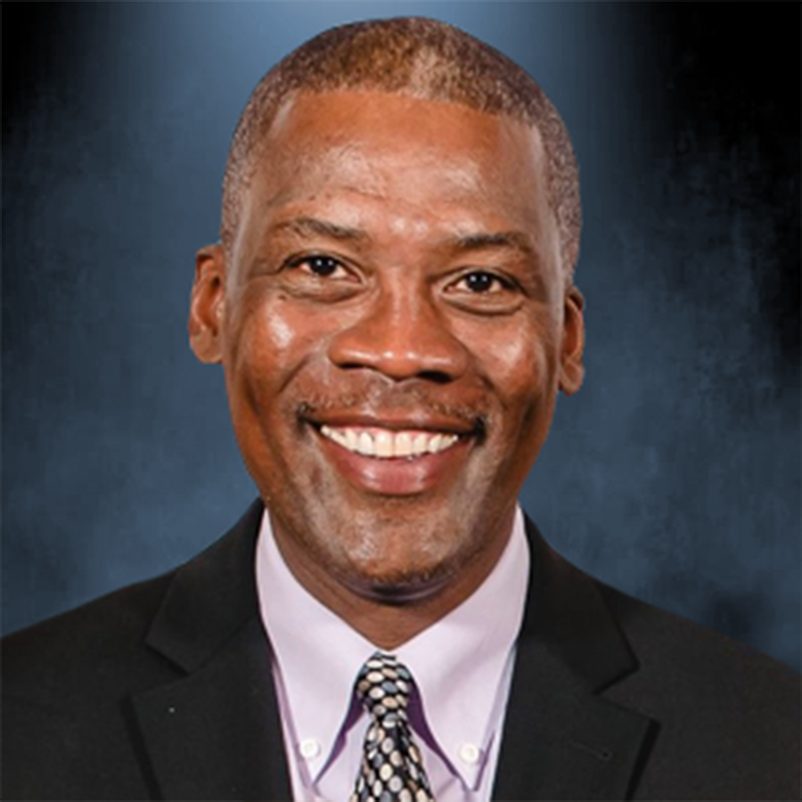

# Boys and Girls Club of Greater Scottsdale

Is an FY25 funded partner of Valley of the Sun United Way.

## About

Boys and Girls Club of Greater Scottsdale, commonly styled as Boys & Girls Clubs of Greater Scottsdale, is a youth development nonprofit serving children and teens across Scottsdale, North Phoenix, Fountain Hills, the Salt River Pima-Maricopa Indian Community, and the Hualapai Nation. The organization provides safe, supportive Club environments where youth development professionals and mentors offer guidance, encouragement, and structured programming during critical non-school hours.

The organization was established in 1954, initially serving 282 youth. Since then, it has expanded its reach through additional Clubs, built and improved facilities, and served generations of young people across the Northeast Valley and Indian Country. Today, thousands of youth participate in BGCS programs through multiple Club locations and community-based supports.

BGCS provides outcome-based programming designed to help success be within reach for all children and teens, regardless of their circumstances. Its program areas include character and leadership, education, workforce readiness, health and fitness, the arts, sports, STEAM learning, and teen services. These programs are intended to help young people build confidence, develop positive relationships, explore interests, prepare for school and work, make healthy choices, and contribute to their communities.

The organization's character and leadership programs include Keystone Club, Torch Club, and Youth of the Year, which help youth build leadership skills, participate in service, and develop good character and citizenship. Its education programs include homework help, tutoring, Power Hour, Summer Brain Gain, America Reads support, college preparation, and STEAM makerspace opportunities that help members strengthen academic and problem-solving skills.

BGCS also prepares teens for future careers through workforce readiness programs such as Diplomas 2 Degrees, Money Matters, Leader in Training, and CareerLaunch. These programs help youth explore career interests, understand financial literacy, build employability skills, and connect learning to real-world work experiences. Health, fitness, sports, and arts programs further support whole-child development by encouraging physical activity, healthy habits, creativity, teamwork, and resilience.

## Mission & Vision

BGCS's mission is to enable all young people, especially those who need the organization most, to reach their full potential as productive, caring, responsible citizens.

Its vision is to provide a world-class Club Experience that assures success is within reach of every young person who enters its doors, with all members on track to graduate from high school with a plan for the future, demonstrating good character and citizenship, and living a healthy lifestyle.

The organization values accountability, inclusivity, integrity, respect, safety, and transparency. Across its Clubs and programs, BGCS emphasizes safe spaces, positive mentorship, personal responsibility, youth voice, healthy development, and opportunities that help young people build great futures.

## Executive Leadership

| Name | Designation | Photo |
| --- | --- | --- |
| Ivan Gilreath | President and Chief Executive Officer |  |
