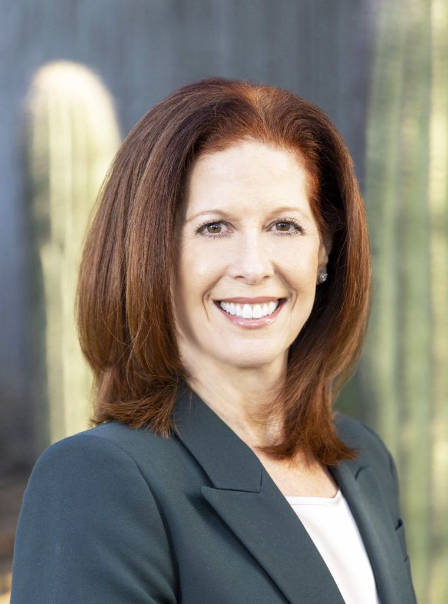

# Boys and Girls Club of the Valley

Not an FY25 funded partner of Valley of the Sun United Way.

## About

Boys and Girls Clubs of the Valley is a major out-of-school-time provider in the Valley, serving children and teens through affordable after-school, summer, and enrichment programming. The organization says it is the largest childcare provider in the Valley and that parents trust BGCAZ to provide a safe, positive, fun environment for their kids when school is out.

BGCAZ serves more than 16,000 youth and teens across the region and operates 30-plus clubhouses in the Phoenix metro area, along with related youth services. Its programs are designed to support young people in grades K-12 through academic help, recreation, social-emotional growth, workforce readiness, and leadership development.

The organization frames its work around a "Formula for Impact" built on four priority outcomes: Academic Success, Health & Well-Being, Character & Leadership, and Life & Workforce Readiness. That model reflects a whole-child approach, with support ranging from homework help and educational enrichment to sports, healthy habits, character development, internships, and career exploration.

BGCAZ also places a strong emphasis on family support. Its programs stay open late and offer affordable rates, snacks, and dinner so families can rely on safe care while they work. The organization presents itself as a community partner that helps children build confidence, resilience, and connection while also helping parents manage the practical demands of daily life.

The Valley of the Sun United Way is specifically thanked on BGCAZ's website for supporting quality after-school programs at the Clubs, which underscores the organization's visible role in the regional nonprofit ecosystem even though it is not listed in the FY25 funded partner reference.

## Mission & Vision

Boys and Girls Clubs of the Valley's mission is to empower young people, especially those who need us most, to reach their full potential as productive, caring, responsible members of the community.

Its vision is to be the premier out-of-school-time provider and leading voice for youth development in Arizona, ensuring youth and teens have the skills and resilience to successfully navigate childhood and prepare for adulthood.

The mission and vision are reflected in the organization's program model. BGCAZ focuses on academic support, healthy decision-making, leadership, and career readiness so young people can succeed both in school and in life. The organization is intentionally structured to help youth build social-emotional strength, develop positive relationships with caring adults, and access opportunities that broaden their future paths.

## Executive Leadership

| Name | Designation | Photo |
| --- | --- | --- |
| Marcia Mintz | President & CEO |  |

