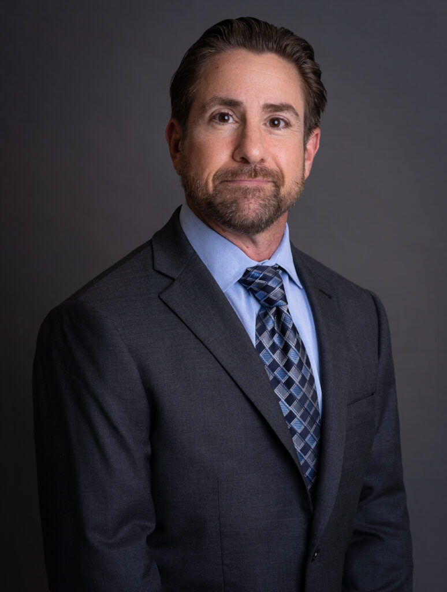

# Community Bridges

Is an FY25 funded partner of Valley of the Sun United Way.

## About

Community Bridges, Inc., commonly known as CBI, is a nonprofit integrated behavioral healthcare provider founded in 1982. The organization provides a full continuum of substance use and mental health services for individuals, families, and communities in need, with services in Arizona, Oklahoma, and Washington, D.C.

CBI uses a holistic and integrated approach to addiction treatment and behavioral health concerns. Its model considers each person's needs and combines education, therapy, housing, medications, peer support, inspiration, hope, and other supportive services to create individualized treatment plans. The organization emphasizes that treatment should not be one-size-fits-all because people and their recovery needs are unique.

CBI's services include crisis care, inpatient care, outpatient treatment, substance use treatment, mental health treatment, medical care, peer support, housing and shelter, homeless outreach, community education, prevention, support for women and children, and other outreach efforts. Its recovery model connects medical services, behavioral health services, case management, peer support, and community resources so people can receive more complete care.

The organization provides immediate access to emergency behavioral care and offers fully integrated treatment that can include nursing care, psychiatric services, substance use treatment, medical services, counseling, case management, medication-assisted treatment, and peer support. CBI works with local authorities, first responders, and partner agencies to help people in crisis find appropriate placement and ongoing care.

CBI has grown from a local Arizona provider into a large integrated healthcare organization. Under its current leadership, CBI operates dozens of programs in Arizona and delivers hundreds of thousands of instances of care each year. Its team includes medical and behavioral health professionals, peers with lived experience, and staff who support crisis response, treatment, recovery, housing, outreach, and community stabilization.

## Mission & Vision

CBI's mission is to maintain the dignity of human life.

Its purpose is to be an agent of positive change in the communities it serves.

The organization's values are humility, service, and empowerment. Across its programs, CBI emphasizes dignity, recovery, integrated care, individualized treatment, peer support, access to services, community partnerships, and practical help for people experiencing addiction, behavioral health challenges, homelessness, crisis, and related barriers to stability.

## Executive Leadership

| Name | Designation | Photo |
| --- | --- | --- |
| John F. Hogeboom | President and Chief Executive Officer |  |
