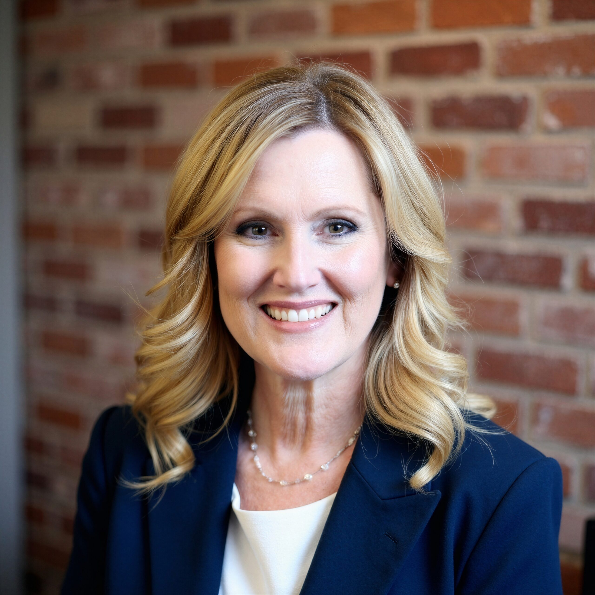

# Delivering Dreams of Arizona

Not an FY25 funded partner of Valley of the Sun United Way.

## About

Delivering Dreams of Arizona is a Phoenix-based nonprofit that has served the Greater Phoenix area for more than 60 years. The organization focuses on programs that meet children's basic needs, build self-esteem, and improve quality of life.

Its work includes direct support for children and families through programs such as school clothing, shoes, hygiene items, books, teddy bears for children in crisis, and other practical supports. The organization also operates a thrift boutique whose proceeds go back into the programs that serve children.

Delivering Dreams presents itself as a community resource that helps children arrive at school ready to learn. Its public materials emphasize both immediate material support and the broader goal of helping children feel prepared, valued, and confident. The organization also relies on volunteers, donations, tax credit gifts, and community partnerships to keep its programs running.

## Mission & Vision

Delivering Dreams of Arizona's mission is to improve the lives of children through programs that fulfill basic needs, foster self-esteem and enhance quality of life.

Its vision is to be the Valley's leading nonprofit agency providing basic needs so that all children enter the classroom ready to learn.

The organization's mission and vision show a focus on both dignity and readiness. It aims to reduce barriers created by poverty and to support children with practical, visible help that can improve daily life and school readiness.

## Executive Leadership

| Name | Designation | Photo |
| --- | --- | --- |
| Aimee Runyon | Chief Executive Officer |  |

