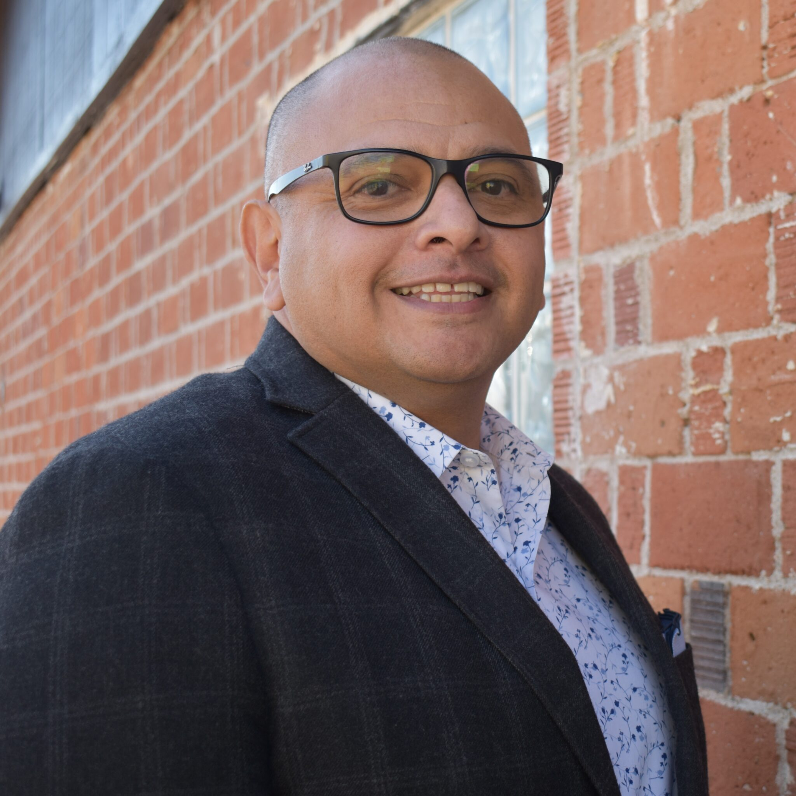

# Free Arts for Abused Children

Not an FY25 funded partner of Valley of the Sun United Way.

## About

Free Arts for Abused Children of Arizona, now operating publicly as Art Heals Arizona, is a Phoenix-based nonprofit focused on transforming children's trauma into resilience through the arts. The organization serves children, teens, young adults, and families who have experienced abuse, neglect, homelessness, and other forms of trauma.

The organization's model is built around the idea that creative expression and supportive mentoring can help young people recover, rebuild trust, and develop resilience. Its public materials describe a research-based approach called Art + Mentors = Resilience, which combines expressive arts with caring adult volunteer mentors. Free Arts also emphasizes trauma-informed care, equity, and social justice in its programming and culture.

The organization offers a variety of programs, including free arts experiences, mentoring, camps, workshops, and family-centered services. It also serves as a thought leader in child welfare, arts and culture, mentoring, and nonprofit spaces. In 2026, the organization announced that it would change its name to Art Heals Arizona, but its mission and services remain the same.

## Mission & Vision

The mission of Art Heals Arizona, formerly Free Arts, is transforming children's trauma to resilience through the arts.

Its vision is that every child who has experienced abuse, neglect, or homelessness has access to resilience-building arts programs and caring adult volunteer mentors.

The organization frames its work as both healing and preventive. By combining creativity, mentoring, and trauma-informed practice, it aims to help children and families build confidence, strengthen relationships, and develop the tools they need to move forward after trauma.

## Executive Leadership

| Name | Designation | Photo |
| --- | --- | --- |
| Matt Sandoval | Executive Director |  |

