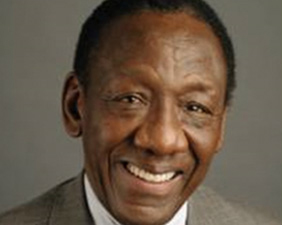

# Greater Phoenix Urban League

Not an FY25 funded partner of Valley of the Sun United Way.

## About

Greater Phoenix Urban League, commonly known as GPUL, is a Phoenix-based nonprofit and affiliate of the National Urban League. The organization works to support minorities and people in need as they pursue economic and social equality through programs in economic empowerment, housing, education, civic engagement, and health and wellness.

GPUL describes itself as an agent of change serving individuals and families across the Valley of the Sun. Its work focuses on providing resources, opportunities, advocacy, and direct services that help community members build more stable and successful futures. The organization has touched thousands of lives in Phoenix and surrounding areas through programs that address barriers to opportunity.

Economic empowerment is one of GPUL's major areas of work. The organization supports job seekers through workforce development, job and skills training, job placement, re-entry employment services, apprenticeships, internships, and employer partnerships. GPUL also supports entrepreneurs and small business owners through its Entrepreneurship Center, offering bootcamps, workshops, business planning support, access-to-capital connections, and opportunities for local businesses to reach the community.

The organization's housing work supports access to safe, decent, affordable, and energy-efficient housing on fair terms. GPUL provides housing-related services and homebuyer education support, helping individuals and families understand the homeownership process and connect with counseling and resources.

GPUL's education, civic engagement, and health and wellness work reflects its broader commitment to equity and community stability. The organization frames its goals around children being ready for kindergarten, college, work, and life; people having access to equity and justice; and community members having access to quality and affordable healthcare.

Through advocacy, bridge-building, program services, research, and partnerships, the Greater Phoenix Urban League works to strengthen underserved communities and advance opportunity across the Phoenix region.

## Mission & Vision

The mission of the Greater Phoenix Urban League is to be an agent of change and to support minorities and those in need in achieving economic and social equality through programs in economic empowerment, housing, education, civic engagement, and health and wellness.

Its vision is reflected in five foundation areas: every person has access to jobs with a living wage and good benefits; every person lives in safe, decent, affordable, and energy-efficient housing on fair terms; every child is ready for kindergarten, college, work, and life; every person has a right to equity and justice; and every person has access to quality and affordable healthcare.

The organization aligns its work with the broader Urban League movement to advance civil rights, economic empowerment, education, housing, workforce development, entrepreneurship, health, quality of life, and social equality for African Americans and other underserved communities.

## Executive Leadership

| Name | Designation | Photo |
| --- | --- | --- |
| George Dean | President and Chief Executive Officer |  |
