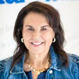

# Make-A-Wish Arizona

Not an FY25 funded partner of Valley of the Sun United Way.

## About

Make-A-Wish Arizona is the Arizona chapter of the Make-A-Wish network and is based in Scottsdale. The chapter traces its roots to the original Make-A-Wish story in Phoenix in 1980, when the global wish-granting movement began with one Arizona child's wish to become a state trooper. Today, the Arizona chapter works across the state to grant life-changing wishes for children with critical illnesses.

The chapter describes itself as a team-oriented, mission-driven organization focused on creating memorable wish experiences for children and their families. Its work goes beyond a single event or gift. Make-A-Wish Arizona emphasizes that a wish can support emotional strength, hope, and resilience during medical treatment, while also giving families, volunteers, donors, sponsors, and medical professionals a way to participate in something meaningful.

Public materials for the Arizona chapter highlight the scale and structure of its work. The organization says it has granted thousands of wishes in Arizona and continues to expand outreach and partnership efforts so it can serve more eligible children each year. Its chapter model includes staff leadership, board support, volunteers, and community fundraising to make wishes possible.

Make-A-Wish Arizona also presents itself as an established community institution. Its chapter page emphasizes transparency around funds, annual audits, and a commitment to stewarding donated resources effectively. The organization frames its work as both deeply personal and highly coordinated, with a focus on serving children across Arizona through a strong network of community supporters.

## Mission & Vision

Make-A-Wish Arizona's mission is together, we create life-changing wishes for children with critical illnesses.

Its vision is to grant the wish of every eligible child in Arizona.

The chapter's mission is rooted in the belief that a wish experience can be a game-changer for a child facing serious illness. In practice, that means using donated resources to create wish experiences that offer hope, joy, and motivation for children and families during difficult times. The organization also sees wishes as something that affects an entire support ecosystem, including families, volunteers, donors, sponsors, medical professionals, and communities.

The vision is ambitious and community-centered. Make-A-Wish Arizona aims to serve every eligible child, strengthen referral and volunteer pipelines, and grow the capacity of its chapter so more wishes can be delivered safely and effectively.

## Executive Leadership

| Name | Designation | Photo |
| --- | --- | --- |
| Fran Mallace | President and Chief Executive Officer |  |
