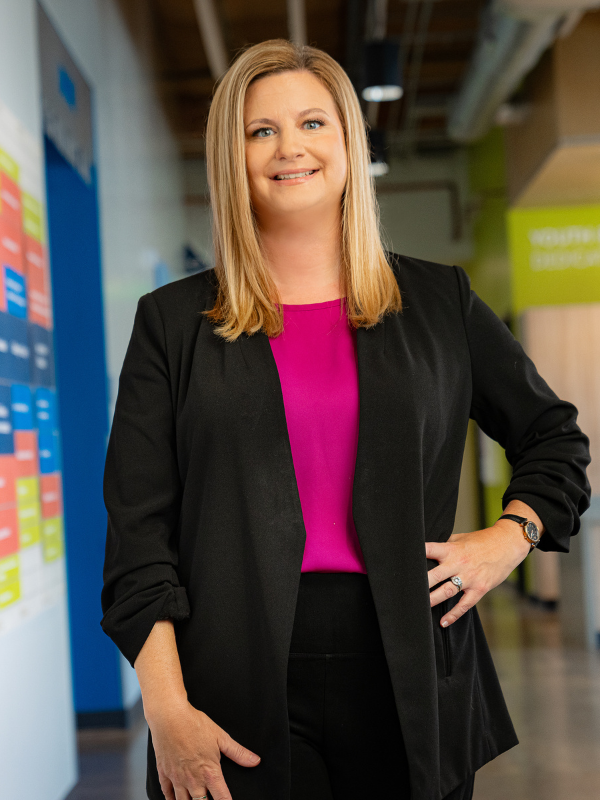

# Rosie's House

Not an FY25 funded partner of Valley of the Sun United Way.

## About

Rosie's House is a Phoenix-based nonprofit music academy that provides free, high-quality music education and youth development programming. The organization serves students from infancy through 12th grade and reaches youth in Phoenix and communities across Arizona through afterschool, summer, and early childhood music programs.

Rosie's House began in 1996 when founder Rosie Schurz opened a home in an underserved Phoenix neighborhood to make music education accessible to children who otherwise might not have that opportunity. Schurz, a German immigrant who had fled Munich during World War II and had to leave behind her violin, built the organization from a belief that every child should experience the gift and discipline of music.

Today, Rosie's House has grown into one of the nation's largest providers of community-based free music education. Its model combines hands-on instruction in multiple musical disciplines with a broader creative youth development approach. Students participate in music learning while also building confidence, discipline, teamwork, focus, creativity, and performance skills.

The organization describes its work as "more than music." In addition to music instruction, Rosie's House provides wraparound supports that may include academic assistance, healthy meals, wellness and mental health supports, college readiness, and family engagement. This comprehensive model is designed to help students grow personally, academically, socially, and creatively.

Rosie's House is rooted in the Eastlake neighborhood of Downtown Phoenix and collaborates with community partners to expand access to arts education. Under Becky Bell Ballard's leadership, the organization completed the More than Music Capital Campaign, secured and expanded its first permanent campus, built a multi-million-dollar operating reserve, increased annual revenue to nearly $3 million, and expanded the number of students served by more than 45 percent in recent years.

## Mission & Vision

Rosie's House's mission is to eliminate barriers to high-quality music education. Through music, the organization supports youth as they develop their full creative and personal potential.

Its vision is a community where all youth have access to music education and opportunities for lifetime achievement.

Rosie's House is guided by core values of opportunity, excellence, creativity, and community. The organization believes the arts are fundamental to humanity, that all youth should have opportunities to explore and learn in the arts, and that high-quality programs should be provided by music education professionals. It also emphasizes creativity as a force for positive change and community as a culture of service, inclusiveness, and equity.

## Executive Leadership

| Name | Designation | Photo |
| --- | --- | --- |
| Becky Bell Ballard | Chief Executive Officer |  |
