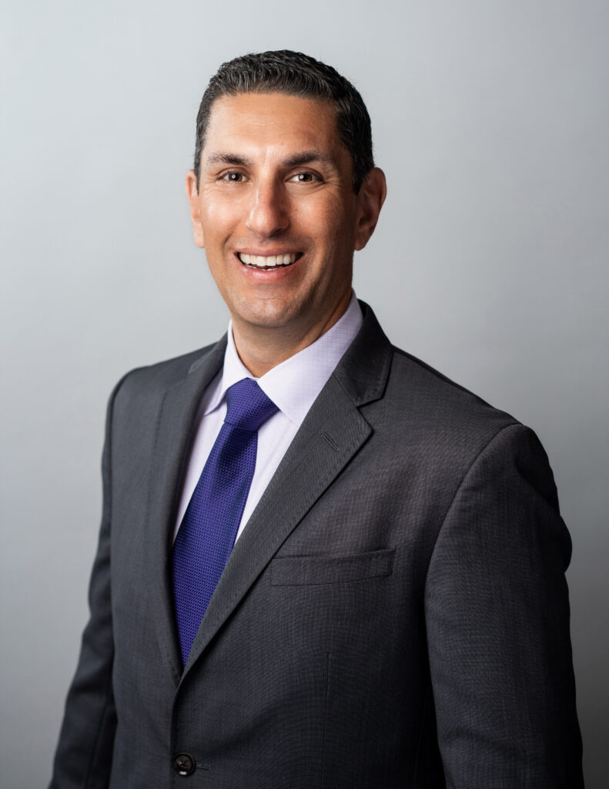

# Southwest Autism Research and Resource Center

Not an FY25 funded partner of Valley of the Sun United Way.

## About

Southwest Autism Research and Resource Center, commonly known as SARRC, is an internationally recognized nonprofit focused on autism research, evidence-based treatment, education, and community outreach. Established in 1997, the organization was founded to create better answers and more reliable support for individuals with autism and their families.

SARRC describes itself as one of the few autism organizations in the world that provides a lifetime of services while also conducting cutting-edge research. Its model combines clinical services, diagnostics, research, training, and community programs so children, teens, adults, and families can access support across the lifespan.

The organization says it serves people through children’s services, family services, teen and adult services, diagnostic services, community services, and ongoing research studies. Its clinical approach is grounded in applied behavior analysis and emphasizes naturalistic, inclusive environments such as home, school, work, and community settings.

SARRC also emphasizes building inclusive communities. Its public materials highlight a commitment to evidence-based practice, meaningful outcomes, and partnership with families and other community stakeholders. It operates state-of-the-art facilities in the Valley and presents itself as an entrepreneurial nonprofit that relies primarily on community support rather than state and federal revenue.

## Mission & Vision

SARRC's mission is to advance research and provide a lifetime of support for individuals with autism and their families.

Its vision is people with autism meaningfully integrated into inclusive communities.

The mission and vision reflect the organization's dual emphasis on rigorous research and practical support. SARRC aims not only to study autism and improve understanding, but also to deliver services that help people with autism achieve greater independence, participation, and quality of life. Its long-term direction includes making effective services available more broadly while continuing to build communities that are welcoming and inclusive.

## Executive Leadership

| Name | Designation | Photo |
| --- | --- | --- |
| Daniel Openden, Ph.D., BCBA-D | President and CEO |  |

