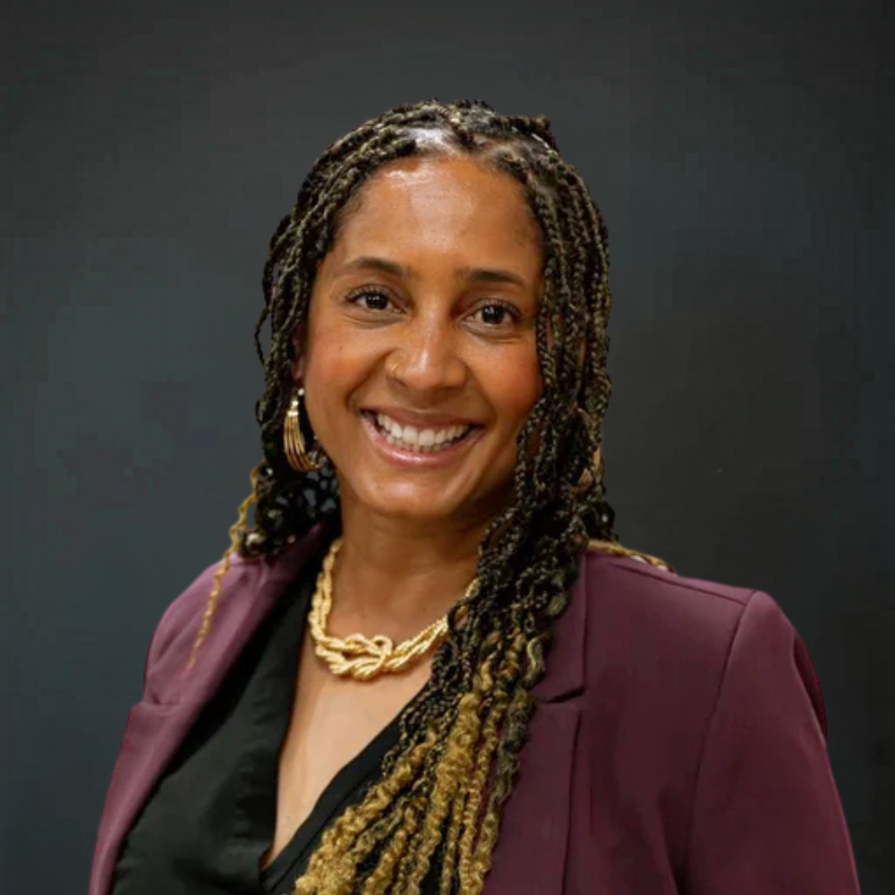

# UMOM New Day Centers

FY25 funded partner of Valley of the Sun United Way.

## About

UMOM New Day Centers is a Phoenix-based nonprofit and one of Arizona's largest providers of shelter and housing services for families and single women experiencing homelessness. Founded in 1964, the organization serves Maricopa County through a combination of emergency shelter, supportive services, rapid rehousing, and permanent affordable housing.

The organization describes its work as a family homelessness response built around restoring hope and rebuilding lives. UMOM's model is not limited to short-term shelter. Instead, it pairs safe temporary housing with individualized support that helps people stabilize, increase income, connect to resources, and move into permanent housing. The organization says it provides safe shelter and supportive services for nearly 800 people each night, including families and single women, and it operates more than 900 units of affordable housing across the Valley.

UMOM's service model emphasizes practical help and long-term stability. Its programs connect shelter residents and community members to jobs, supportive services, housing pathways, and education resources. The organization also operates Helpings Cafe & Catering, which appears to support its social enterprise and job-training efforts while creating a community-facing workforce opportunity.

Across its public materials, UMOM presents itself as an innovative leader working to make family homelessness rare, brief, and non-recurring. Its services are built around collaboration with community partners and a trauma-informed, person-centered approach. The organization also highlights values of learning, elevating others, achieving together, and driving toward a safe place to call home for every family it serves.

## Mission & Vision

UMOM's mission is to end family homelessness by restoring hope and rebuilding lives.

The organization also frames its broader purpose as preventing and ending homelessness through shelter, housing, and supportive services. Its public messaging emphasizes a clear pathway from crisis to stability: emergency shelter first, then supportive services, then housing solutions that help families and single women move toward independence.

UMOM's vision, expressed through its website and program model, is a community where families do not have to sleep on the street and where homelessness becomes rare, brief, and non-recurring. The organization says this goal is attainable through collaboration, resources, and coordinated action across the community.

Its stated values are:

- Learn: pursue growth and solutions and keep improving.
- Elevate: lift others up with kindness, empathy, and respect.
- Achieve: solve big problems together.
- Drive: keep working until all families have a safe place to call home.

These values show up across UMOM's shelter, housing, employment, and support programs, reinforcing a mission focused on dignity, stability, and long-term outcomes rather than emergency relief alone.

## Executive Leadership

| Name | Designation | Photo |
| --- | --- | --- |
| Monique Lopez | Chief Executive Officer |  |

