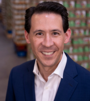

# United Food Bank

FY25 funded partner of Valley of the Sun United Way.

## About

United Food Bank is an Arizona food bank based in Mesa that works to alleviate hunger across a large service area in the East Valley and beyond. Founded in July 1983, the organization began as United Food Distribution Center, Inc. through a collaborative effort involving local cities and United Way organizations.

The food bank now serves a broad region that includes Gila County, Pinal County, parts of Apache and Navajo counties, and eastern Maricopa County. Its network of more than 125 partner organizations helps distribute food and other support to children, seniors, and families facing food insecurity.

United Food Bank emphasizes the scale and practicality of its work. It rescues and distributes food through grocery rescue, donations, food drives, and partnerships with grocers, food producers, and community supporters. The organization says it distributes more than 21.6 million pounds of food each year, and its public materials note that every $1 donated can help provide three nutritious meals.

The organization also frames itself as a community hub, not just a food distribution site. In addition to food rescue and distribution, it supports volunteering, fundraising, food and funds drives, and partner agency coordination. Its public messaging highlights a mission centered on uniting communities to alleviate hunger in Arizona.

## Mission & Vision

United Food Bank's mission is to unite communities to alleviate hunger in Arizona.

Its public vision is reflected in the scale and structure of its programs: a community where hungry neighbors have access to nutritious food through coordinated partner agencies, volunteers, and donors. The organization centers its work on practical hunger relief, community partnership, and efficient food recovery so that more food reaches more people who need it.

The mission also reflects a belief that ending hunger requires broad collaboration. United Food Bank repeatedly emphasizes partnerships with local agencies, volunteers, donors, and corporate supporters as essential to keeping food moving from sources of surplus to families and individuals in need.

## Executive Leadership

| Name | Designation | Photo |
| --- | --- | --- |
| Jason Reed | President and Chief Executive Officer |  |
