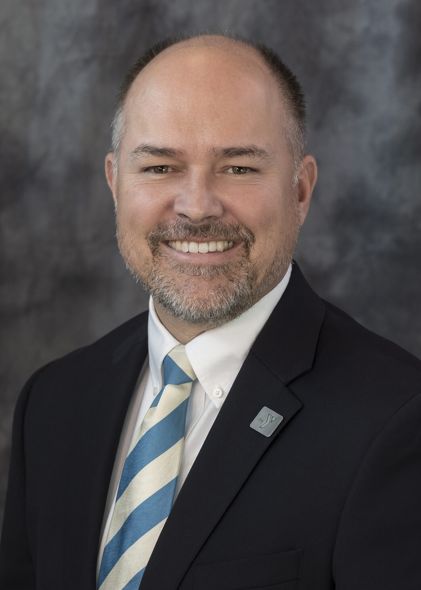

# Valley of the Sun YMCA

FY25 funded partner of Valley of the Sun United Way.

## About

The Valley of the Sun YMCA is one of Arizona's oldest and largest nonprofits, with roots dating back to 1892, before Arizona became a state. The organization serves communities across the Valley and beyond through branches, school-based programs, camps, childcare, fitness, swim, youth development, and family support services.

At its core, the YMCA positions itself as a community organization for everyone. Its public mission language emphasizes building healthy spirit, mind, and body for all through Christian principles put into practice. The organization also stresses inclusion, fairness, and opportunity, describing itself as a welcoming place where people of all ages, backgrounds, and abilities can belong and grow.

The Valley of the Sun YMCA's impact is broad. Its public materials say more than 1,000,000 people walk through its doors each year. The organization operates 12 YMCA branch locations across Arizona, along with before- and after-school programs, early learning centers, and an overnight camp. It also provides financial assistance and insurance-based memberships so more people can access its services regardless of income.

Programmatically, the YMCA offers a wide range of services including youth and family engagement, teens programs, camp, childcare, health and fitness, sports, and swim instruction. It also extends into health-related services and community wellness initiatives, showing that the organization is not just a recreation provider but a broader community support system.

The Valley of the Sun YMCA describes its work as strengthening communities through shared effort. Its message is that the Y is a place where people can improve their health, build connections, and find support for their families while contributing to a stronger civic fabric across the region.

## Mission & Vision

The Valley of the Sun YMCA's mission is to put Christian principles into practice through programs that build healthy spirit, mind, and body for all.

Its broader cause is to strengthen community for all. The organization says it is committed to being welcoming and to using collective effort to support fairness and opportunity for everyone. That framing reflects a mission that combines personal growth with community responsibility.

The YMCA's vision is expressed through its public promise that "the Y is for everyone." In practice, that means creating places and programs where people can belong, connect, and thrive. The organization aims to help individuals and families reach their full potential through accessible services, financial assistance, and inclusive programming.

Its public values are reflected in its work across youth development, healthy living, and social responsibility. Those values show up in childcare, youth sports, swim lessons, camps, health services, and family support programs, all designed to help people live healthier and more connected lives.

## Executive Leadership

| Name | Designation | Photo |
| --- | --- | --- |
| J. Bryan Madden | President & Chief Executive Officer |  |
